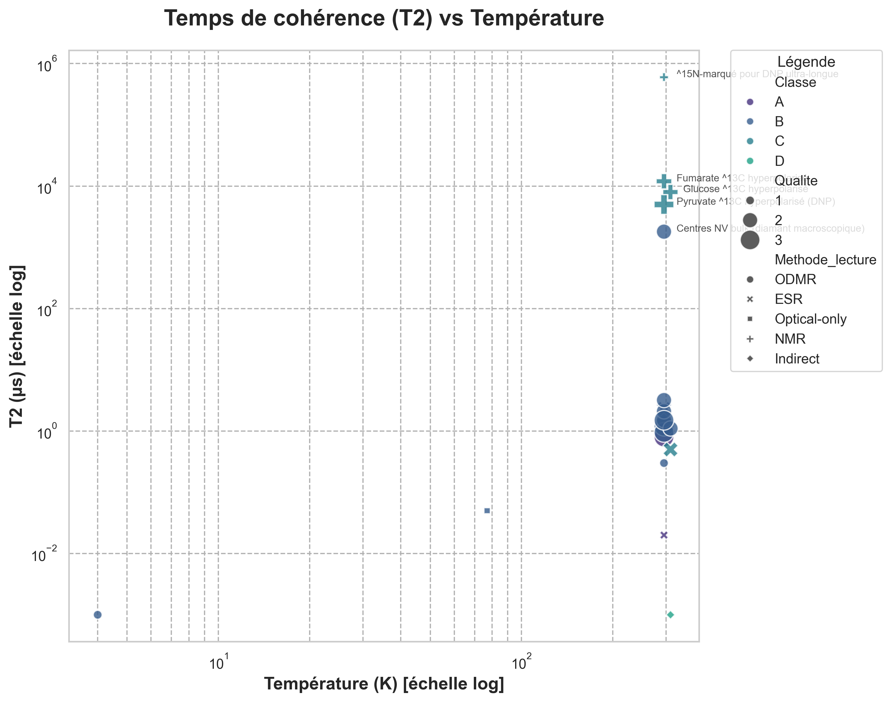
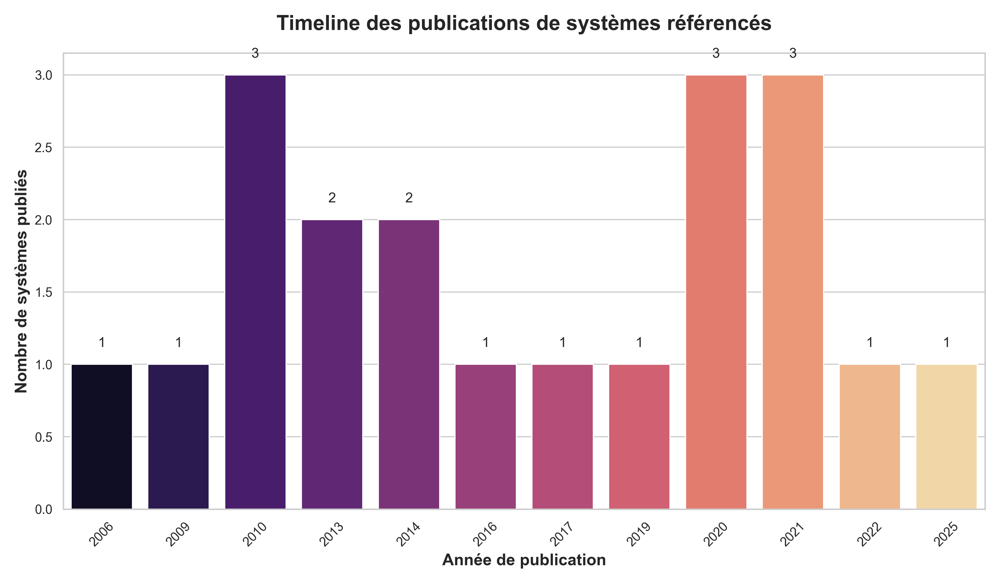

# Biological Qubits Catalog - Technical Documentation

[Live dashboard](https://mythmaker28.github.io/Quantum-Sensors-Qubits-in-Biology/)

[](https://doi.org/10.5281/zenodo.17420604)
[](https://creativecommons.org/licenses/by/4.0/)


---

## Status and versioning

- Current stable: **v3.0.0** - 82 qubits (classes A, A', B, C, D) + 187 curated FP biosensors.
- Peer-review: planned (Data Descriptor submission Q1 2026).
- DOI: pending Zenodo deposit for v3.0; `10.5281/zenodo.17420604` preserved for v1.2.1 (Frontiers).
- Live dashboard: [https://mythmaker28.github.io/Quantum-Sensors-Qubits-in-Biology/](https://mythmaker28.github.io/Quantum-Sensors-Qubits-in-Biology/).

### Research dataset disclaimer

This is an actively curated research dataset under continuous development. Release v3.0.0 is production-ready for research use with full provenance tracking. Always cite stable versions in publications and verify original sources via provided DOIs and PMCIDs. This dataset has not yet undergone formal peer review; a Data Descriptor submission is planned for Q1 2026.

### Data quality tiers (FP atlas)

- Tier 1 (curated): 187 systems, modelling-ready, full metadata.
- Tier 2 (candidates): ~13 systems, incomplete metadata, curation queue.
- Tier 3 (unknown/staging): ~103 systems, placeholder data, kept for transparency.

Use Tier 1 for machine learning and quantitative analysis.

---

## Vue d'ensemble

Base de données structurée et vérifiée de tous les systèmes quantiques biologiques ou bio-compatibles utilisés comme qubits ou capteurs quantiques dans un contexte vivant (in vitro, in cellulo, in vivo).

### Clarification - "Qubits" vs "Sondes quantiques"

Terminologie inclusive : cet atlas utilise "qubits biologiques" au sens large pour inclure :

1. Qubits contrôlables : systèmes avec manipulation cohérente d'états quantiques.
   - Exemples : NV (ODMR), SiC (ODMR), EYFP / MagLOV / mScarlet-FMN (classe A', 2025), protéines ODMR-relay.
   - Critère : lecture de spin + manipulation micro-ondes démontrée.

2. Sondes quantiques passives : systèmes exploitant des propriétés quantiques pour la mesure.
   - Exemples : NMR hyperpolarisée (spins nucléaires 13C, 129Xe), TEMPO (imagerie EPR).
   - Critère : cohérence quantique mesurée, application biologique.

3. Candidats mécanistiques : hypothèses de fonctions quantiques biologiques.
   - Exemples : cryptochrome (magnétoréception), FMO (cohérence photosynthétique).
   - Critère : effet quantique proposé, débat scientifique actif.

Justification : la frontière "qubit pur" vs "sonde quantique" est floue en contexte biologique. L'atlas documente tous les systèmes quantiques pertinents pour applications biologiques.

Pour chercheurs en quantum computing : filtrer par `Methode_lecture=ODMR` et `Classe IN (A, A_prime, B)` pour les qubits contrôlables stricts.

### Version 3.0.0 - Current stable release
- `data/qubits/biological_qubits_v3.csv` : 82 qubits (single source of truth, schéma `SCHEMA_v3.md`).
- `data/optical/curated/atlas_fp_optical_v3_curated.csv` : 187 biosensors FP (Tier 1).
- Legacy CSVs (pre-v3) archivés sous `data/qubits/archive/pre_v3/` et `data/optical/curated/atlas_fp_optical_v2_2_curated.csv`.
- [OK] Interactive Dashboard with real-time filtering (docs/index.html)
- [OK] FAIR 12/12 compliance (Findable, Accessible, Interoperable, Reusable)
- [OK] Full provenance tracking (Source_T2, Source_T1, Source_Contraste, DOI)
- [OK] Quantified uncertainties (T2_us_err, T1_s_err, Contraste_err)
- [OK] Reproducible analysis layer (analysis/*.py with JSON/Markdown outputs)
- [OK] Cross-platform validation (Windows/Linux/Mac compatible)
- [ARCHIVE] Historical versions (v1.2, v1.3, v2.0) in `archive/` folder

## 📊 Aperçu visuel

Voici un aperçu des données actuelles :

| T2 vs Température | Timeline des publications |
|:---:|:---:|
|  |  |


Ce projet recense les systèmes de **4 classes** :
- **Classe A** : Bio intrinsèque (protéines/molécules biologiques natives)
- **Classe B** : Bio-compatibles internalisés (nanoparticules NV, SiC, etc.)
- **Classe C** : Spins nucléaires (NMR, hyperpolarisation ^13C/^15N)
- **Classe D** : Candidats mécanistiques (hypothèses, preuves indirectes)

---

## 📁 Structure du projet

```
/biological-qubits-atlas
  ├─ data/
  │   ├─ processed/
  │   │   ├─ atlas_fp_optical_v2_2_curated.csv  # v2.2.2: 180 FP systems (curated, modeling-ready)
  │   │   └─ atlas_fp_optical_v2_2.csv          # v2.2.2: 296 systems (mixed tiers)
  │   └─ qubits/
  │       ├─ biological_qubits.csv              # 34 quantum systems (DISTINCT from FP)
  │       └─ README.md                          # Explains FP vs qubits distinction
  ├─ analysis/
  │   ├─ qubits_stats.py                        # Qubit statistics (functional)
  │   ├─ class_comparisons.py                   # FP family comparisons (functional)
  │   ├─ descriptive_stats.py                   # FP descriptive stats (functional)
  │   └─ output/                                # Reproducible outputs (JSON/Markdown)
  ├─ scripts/
  │   ├─ qa/                                    # Quality assurance (validate_*.py)
  │   ├─ etl/                                   # Extract, transform, load
  │   └─ web/                                   # Dashboard generation
  ├─ docs/
  │   ├─ index.html                             # Interactive dashboard
  │   ├─ quantum_mechanisms.md                  # Quantum physics documentation
  │   ├─ photosynthesis.md, magnetoreception.md # Scientific docs
  │   └─ nv_centers_qubits.md                   # NV centers reference
  ├─ conversation-bus-module/                   # Multi-agent infrastructure
  ├─ archive/                                   # Historical versions (v1.2, v1.3, v2.0)
  ├─ LICENSE                                    # CC BY 4.0 (data)
  ├─ LICENSE.CODE                               # MIT (code)
  ├─ CITATION.cff                               # Citation machine-readable
  ├─ README.md                                  # Main documentation
  └─ DOCUMENTATION.md                           # This file (technical docs)
```

---

## 🚀 Comment lancer localement

### ⚠️ Important : CORS et serveur local

Le dashboard charge les données depuis `data/processed/atlas_fp_optical_v2_0.csv` via `fetch()`. Si vous ouvrez le fichier HTML directement (`file://`), les navigateurs modernes **bloquent** le chargement pour des raisons de sécurité (politique CORS).

### Solutions recommandées

#### Option 1 : GitHub Pages (recommandé)

Le dashboard est déployé automatiquement sur GitHub Pages :
- 🌐 **[https://mythmaker28.github.io/Quantum-Sensors-Qubits-in-Biology/](https://mythmaker28.github.io/Quantum-Sensors-Qubits-in-Biology/)**

#### Option 2 : VS Code Live Server

1. Installez l'extension **Live Server** dans VS Code
2. Clic droit sur `docs/index.html` → **"Open with Live Server"**
3. Le navigateur s'ouvre automatiquement sur `http://127.0.0.1:5500/docs/index.html`

#### Option 3 : Python HTTP Server

```bash
# Dans le répertoire du projet
python -m http.server 8000

# Puis ouvrez dans le navigateur
# http://localhost:8000/docs/index.html
```

#### Option 4 : Node.js http-server

```bash
# Installation (une fois)
npm install -g http-server

# Lancement
http-server -p 8000

# Ouvrez http://localhost:8000/docs/index.html
```

#### Option 5 : Autres serveurs locaux

- **PHP** : `php -S localhost:8000`
- **Ruby** : `ruby -run -ehttpd . -p8000`

---

## 📦 Data Access (v2.0)

### 🟢 Current Stable Release (v2.0.0)

| Artefact | Format | Description | Lien |
|----------|--------|-------------|------|
| **Atlas Principal** | CSV | **113 systèmes** (FP + quantum sensors) | [`data/processed/atlas_fp_optical_v2_0.csv`](data/processed/atlas_fp_optical_v2_0.csv) |
| **Dashboard Interactif** | HTML | Filtres, tri, export, statistiques | [`docs/index.html`](https://mythmaker28.github.io/Quantum-Sensors-Qubits-in-Biology/) |
| **Checksums** | TXT | SHA256 pour validation d'intégrité | [`data/processed/SHA256SUMS_v2.0.txt`](data/processed/SHA256SUMS_v2.0.txt) |
| **Metadata** | JSON | Training metadata (FAIR) | [`data/processed/TRAINING.METADATA.v2.0.json`](data/processed/TRAINING.METADATA.v2.0.json) |

### 📜 Historical Versions

Versions archivées (v1.2, v1.3) disponibles dans le dossier [`archive/`](archive/) :
- **v1.3.0-beta** : 80 systèmes, hybrid curated expansion
- **v1.2.1** : 26 systèmes, full provenance tracking

Pour accéder aux versions archivées :
```bash
ls archive/2025-10-24-pre-v2-clean/
```

---

## 📊 Schéma de données v2.0 (CSV)

### Colonnes obligatoires

**✨ v2.0** : Extension du schéma pour inclure les protéines fluorescentes (FP) et les quantum sensors

| Colonne | Type | Description |
|---------|------|-------------|
| `Systeme` | Texte | Nom du système biologique/biocompatible |
| `Classe` | A/B/C/D | Classification (voir ci-dessous) |
| `Hote_contexte` | Texte | Contexte biologique (in vitro, in cellulo, ex vivo, in vivo) |
| `Methode_lecture` | Texte | Technique de lecture : **ODMR, ESR, NMR, Optical-only, Indirect** |
| `Frequence` | Texte | Fréquence de résonance avec unité (ex: "2.87 GHz", "128 MHz") |
| `B0_Tesla` | Nombre | **[NOUVEAU]** Champ magnétique externe en Tesla |
| `Spin_type` | Texte | **[NOUVEAU]** Type de spin : "Electron" ou "Noyau; ^13C" (préciser isotope) |
| `Defaut` | Texte | **[NOUVEAU]** Type de défaut (NV, VSi, VV, GeV, SiV, etc.) ou NA |
| `Polytype_Site` | Texte | **[NOUVEAU]** Pour SiC : polytype (4H/6H) et site (V1/V2/hh/kk) |
| `T1_s` | Nombre | **[NOUVEAU]** Temps de relaxation T1 en **secondes** (ou NA) |
| `T2_us` | Nombre | Temps de cohérence T2 en **microsecondes** |
| `Contraste_%` | Nombre | Contraste de lecture en pourcentage (ou NA) |
| `Temperature_K` | Nombre | Température en **Kelvin** |
| `Taille_objet_nm` | Nombre | **[NOUVEAU]** Taille des nanoparticules en nm (ou NA) |
| `Photophysique` | Texte | Paramètres optiques (si applicable) |
| `Conditions` | Texte | Conditions expérimentales détaillées |
| `Limitations` | Texte | Limitations identifiées |
| `In_vivo_flag` | 0/1 | **[NOUVEAU]** 0 = in vitro/in cellulo, 1 = in vivo (organisme entier) |
| `DOI` | Texte | DOI de la publication source |
| `Annee` | Nombre | Année de publication |
| `Qualite` | 1/2/3 | Qualité de la démonstration (voir ci-dessous) |
| `Verification_statut` | verifie / a_confirmer | Statut de vérification |
| `Notes` | Texte | Informations complémentaires |

#### ✨ Nouvelles colonnes v1.2 (provenance & qualité)

| Colonne | Type | Description |
|---------|------|-------------|
| `Source_T2` | Texte | **[v1.2]** Source de la valeur T2 (format: "DOI:xxx Fig.X") |
| `Source_T1` | Texte | **[v1.2]** Source de la valeur T1 (format: "DOI:xxx Fig.X") |
| `Source_Contraste` | Texte | **[v1.2]** Source du contraste ODMR/ESR |
| `T2_us_err` | Nombre | **[v1.2]** Incertitude sur T2 en µs (±σ) |
| `T1_s_err` | Nombre | **[v1.2]** Incertitude sur T1 en secondes (±σ) |
| `Contraste_err` | Nombre | **[v1.2]** Incertitude sur contraste en % (±σ) |
| `Hyperpol_flag` | 0/1 | **[v1.2]** 1 = système hyperpolarisé (DNP, etc.) |
| `Cytotox_flag` | 0/1 | **[v1.2]** 1 = cytotoxicité documentée |
| `Toxicity_note` | Texte | **[v1.2]** Notes sur toxicité (doses, conditions) |
| `Temp_controlled` | 0/1 | **[v1.2]** 1 = température contrôlée expérimentalement |

---

## 🔬 Classification des systèmes

### Classe A – Bio intrinsèque

Entités biologiques **natives** agissant elles-mêmes comme qubit/capteur.

**Exemples** :
- Protéines fluorescentes avec lecture ODMR (Nature 2025, Chicago)
- Domaines LOV2 modifiés (flavine)

**Critères d'inclusion** :
- Molécule biologique (protéine, cofacteur, chromophore)
- Lecture de spin optique ou RF en contexte biologique
- Pas d'ajout de nanoparticule externe

---

### Classe B – Bio-compatibles internalisés

Qubits **solides** introduits dans cellules/tissus/organismes.

**Exemples** :
- Nanodiamants avec centres NV (< 100 nm)
- Défauts VSi dans nanoparticules de SiC
- Nanotubes de carbone avec défauts sp3
- Quantum dots (si biocompatibles)

**Critères d'inclusion** :
- Nanoparticule/matériau solide
- Internalisé dans cellule ou injecté in vivo
- Lecture ODMR/ESR démontrée en contexte biologique

---

### Classe C – Spins nucléaires en biologie

Systèmes NMR/hyperpolarisés exploités **in vivo** pour capteurs métaboliques.

**Exemples** :
- Pyruvate ^13C hyperpolarisé (imagerie métabolique)
- Glucose, fumarate ^13C
- ^15N ultra-longue durée de vie
- Radicaux nitroxyde (TEMPO) en imagerie EPR

**Critères d'inclusion** :
- Spin nucléaire ou électronique
- Hyperpolarisation (DNP, etc.) ou lecture NMR/ESR
- Application in vivo démontrée ou potentielle
- Même si pas "qubit contrôlé" strict, objectif = mesure quantique en vivant

---

### Classe D – Candidats mécanistiques

Mécanismes biologiques **proposés** (hypothèses), preuves souvent **indirectes**.

**Exemples** :
- Cryptochrome (paires radicalaires, magnétoréception)
- Magnétosomes bactériens
- FMO complex (cohérence quantique photosynthèse)

**Critères d'inclusion** :
- Hypothèse de mécanisme quantique biologique
- Publication primaire disponible
- Marqué explicitement comme "hypothèse/indirect"

**Exclusion** :
- Théories sans publication peer-reviewed
- Spéculations sans données expérimentales

---

### ⚛️🧬 Frontière Biologie Quantique

**Hypothèse unificatrice** : La biologie optimise la **fonction sous bruit**, pas la **durée de cohérence**.

#### Observation Centrale

L'atlas révèle une tendance intrigante : les systèmes biologiques optimisent pour des **fonctions quantiques robustes** (noise-assisted quantum processes), PAS pour une **cohérence longue** nécessitant isolation parfaite.

**Exemples dans l'Atlas** :

| Système | T2 | Fonction | Observation Clé |
|---------|-----|----------|-----------------|
| **FMO complex** | 0.6 ns | Transfert énergie (<100 fs) | T2 court mais >> temps transfert ✅ |
| **Cryptochrome** | ~1 ns | Magnétoréception (paires radicalaires) | Cohérence suffisante pour recombinaison ✅ |
| **Tyrosyl-RNR** | 15 ns | Catalyse ADN (transfert ~ps) | T2 >> temps réaction, suffisant ✅ |

**Implication** : **T2 court ≠ dysfonction** si temps_fonction << T2

#### Le Paradoxe du Tyrosyl

L'atlas contient maintenant **2 radicaux tyrosyl** dans des contextes évolutifs différents :

- **RNR** (Classe A) : T2=15ns, catalyse rapide, transitoire, universel
- **Cryptochrome Cry4** (Classe D) : T2=1ns, magnétoréception, stable, oiseaux migrateurs

**Question** : Même radical, T2 similaires (~1-15 ns), mais fonctions opposées (catalyse vs détection). Pourquoi ?

**Réponse** : L'évolution optimise pour la **fonction**, pas pour T2. La cohérence longue n'est sélectionnée que si elle procure un **avantage adaptatif direct**.

#### Débats Actifs

**Photosynthèse** (FMO complex, Engel 2007, Nature) :
- Pour : Cohérence quantique robuste améliore transfert énergie
- Contre : Explications classiques suffisantes, artefacts de mesure
- Statut : **Débat actif depuis 18 ans** (14 000+ citations)

**Magnétoréception** (Cryptochromes) :
- Pour : Paires radicalaires sensibles champ B terrestre (50 µT)
- Contre : Mécanismes alternatifs (magnétite, autres)
- Statut : **Recherche active**

#### Références Clés

- **FMO** : Engel et al., Nature 2007 (DOI: 10.1038/nature05678)
- **Cryptochrome** : Hore & Mouritsen, Ann. Rev. Biophys. 2016
- **RNR** : Stubbe & van der Donk, Chem. Rev. 1998

**Pour approfondir** : Voir `PARADOXE_TYROSYL_ANALYSE.md` et `RESEARCH_BACKLOG.md`

**Avertissement** : Les systèmes de classe D représentent des hypothèses en cours de validation. Les interprétations quantiques sont débattues et doivent être considérées avec prudence scientifique

---

## 📐 Politique des unités v1.1 (normalisation stricte)

### Température
- **Unité** : Kelvin (K)
- **Conversions** :
  - RT (room temperature) = **295 K** (≈22 °C)
  - 37 °C (température corporelle) = **310 K**
  - Cryogénique : 77 K (azote liquide), 4 K (hélium liquide)

### Champ magnétique (B0_Tesla)
- **Unité** : Tesla (T)
- **Exemples** :
  - ODMR NV/SiC : **0.005 T** (~5 mT, champ faible pour lever dégénérescence)
  - ESR bande X : **0.34 T** (9.5 GHz)
  - RMN 3 T : **3.0 T** (champ fort pour imagerie)
  - Champ terrestre : **0.00005 T** (50 µT)

### Temps de cohérence (T2)
- **Unité** : Microsecondes (µs)
- **Conversions** :
  - 1 ms → 1000 µs
  - 1 ns → 0.001 µs
  - 1 s → 1,000,000 µs

**Exemple** :
- NV bulk : T2 = 1.8 ms → **1800 µs**
- Pyruvate ^13C : T2 ≈ 5 ms → **5000 µs**

### Temps de relaxation (T1) — **[NOUVEAU v1.1]**
- **Unité** : Secondes (s)
- **Conversions** :
  - 1 ms → 0.001 s
  - 1 µs → 0.000001 s
  - 1 min → 60 s

**Exemple** :
- NV bulk : T1 ≈ 3 ms → **0.003 s**
- Pyruvate ^13C : T1 ≈ 60 s → **60 s**
- ^15N DNP : T1 > 15 min → **900 s**

**Importance** : T1 est **critique** pour l'hyperpolarisation NMR car il limite la fenêtre d'observation.

### Fréquence
- **Unité** : GHz ou MHz (explicitement indiqué)
- **Exemples** :
  - ODMR NV : **2.87 GHz**
  - ODMR VSi : **1.35 GHz**
  - NMR à 3 T : **128 MHz** (pour ^13C)
  - ESR bande X : **9.5 GHz**

### Contraste
- **Unité** : Pourcentage (%)
- Typiquement 5-30% pour ODMR NV, <5% pour nouveaux systèmes

---

## 🎯 Périmètre : Inclusions / Exclusions

### ✅ À inclure

1. **Systèmes bio-compatibles RT** : ODMR, ESR, NMR appliqués en contexte biologique à température ambiante ou physiologique
2. **Démonstrations in vitro → in cellulo → in vivo** : Toutes les étapes de développement
3. **Hyperpolarisation in vivo** : ^13C, ^15N pour imagerie métabolique
4. **Candidats mécanistiques** : Si publication primaire disponible (classe D)

### ❌ À exclure

1. **Qubits purement cryogéniques** : Sans perspective biologique (ex: qubits supraconducteurs)
2. **Dispositifs jamais testés en bio** : Matériaux non biocompatibles, aucune expérience cellulaire/in vivo
3. **Théories sans publication** : Spéculations sans données peer-reviewed

---

## 🔍 Fonctionnalités de l'interface web

### Recherche
- **Recherche globale** : Tous les champs (système, DOI, méthode, notes)
- **Temps réel** : Filtrage instantané à la frappe

### Filtres
- **Classe** : A / B / C / D
- **Méthode de lecture** : ODMR, ESR, NMR, OADF, Indirect
- **Contexte** : In vitro / In vivo
- **Qualité** : 1 / 2 / 3

### Tri
- **Cliquez sur les en-têtes** pour trier
- **Tri ascendant/descendant** : Indicateur visuel (↑ / ↓)
- **Colonnes triables** : Toutes (numérique ou alphabétique)

### Export
- **Bouton "Exporter CSV"** : Télécharge les données filtrées
- **Nom du fichier** : `biological_qubits_export_YYYY-MM-DD.csv`

### Statistiques en temps réel
- Total d'entrées
- Entrées affichées (après filtrage)
- Nombre par classe (A/B/C/D)
- Nombre in vivo

---

## 📈 Échelle de qualité (1-3)

### Qualité 3 ⭐⭐⭐
**Contrôle cohérent + lecture claire + démonstration biologique robuste**

**Critères** :
- Lecture ODMR/ESR/NMR démontrée en contexte biologique réel
- Paramètres quantifiés (T2, contraste, fréquence)
- Reproductibilité validée
- Publication majeure (Nature, Science, PNAS, etc.)

**Exemples** :
- Nanodiamants NV en cellules HeLa (PNAS 2010)
- Pyruvate ^13C hyperpolarisé in vivo (PNAS 2006)
- Protéine fluorescente ODMR (Nature 2025)

---

### Qualité 2 ⭐⭐
**Solide mais partiel**

**Critères** :
- Démonstration technique convaincante
- Mais : in vitro uniquement, ou manque de paramètres clés
- Potentiel biologique clair mais non encore pleinement exploité

**Exemples** :
- Défauts SiC en milieu aqueux (Science Advances 2019)
- Glucose ^13C hyperpolarisé (MRM 2016)
- Centres GeV bioconjugués (ACS Photonics 2021)

---

### Qualité 1 ⭐
**Indicatif / indirect / exploratoire**

**Critères** :
- Preuve de concept préliminaire
- Ou : lecture indirecte (comportement animal)
- Ou : performances actuelles limitées (T2 très court, contraste faible)

**Exemples** :
- Cryptochrome / magnétoréception (Nature 2010) — classe D, indirect
- LOV2 modifiée (JACS 2021) — T2 = 0.02 µs, signal faible
- Quantum dots cryogéniques (PRL 2010) — non RT

---

## 🛠️ Comment contribuer

👉 **Guide complet** : Voir [CONTRIBUTING.md](CONTRIBUTING.md)

### Quick Start (< 10 minutes)

1. **Fork** ce repository
2. **Cloner** localement : `git clone https://github.com/VOTRE_USERNAME/biological-qubits-atlas.git`
3. **Créer une branche** : `git checkout -b add-entry-VOTRE-SYSTEME`
4. **Ajouter une ligne** au CSV `biological_qubits.csv`
5. **Valider** : `make lint` (ou `python qubits_linter.py`)
6. **Commit** : `git commit -m "feat(data): add [système] from DOI:10.xxxx"`
7. **Push & Pull Request** : `git push origin add-entry-VOTRE-SYSTEME`

### Commandes Rapides (Makefile)

```bash
make setup      # Installer dépendances
make lint       # Valider le CSV
make qc         # Générer QC_REPORT.md
make figures    # Générer les graphiques
```

### Ajouter une nouvelle entrée

1. **Vérifiez le périmètre** : Le système est-il bio-compatible ou bio-intrinsèque ?
2. **Trouvez la publication source** : DOI obligatoire
3. **Extrayez les données** : T2, contraste, température, méthode
4. **Normalisez les unités** : Cf. politique ci-dessus
5. **Ajoutez au CSV** : Respectez l'ordre des colonnes
6. **Marquez le statut** : `verifie` si vous avez lu la source, `a_confirmer` sinon

### Format d'entrée CSV

```csv
"Nouveau système",A,"Cellules HeLa",ODMR,"2.87 GHz",1.0,10,295,"ex_488nm; em_520nm","Conditions détaillées","Limitations identifiées",in_vivo,"10.xxxx/xxxxx",2025,2,a_confirmer,"Notes complémentaires"
```

---

## 📚 Ressources et références

### Publications fondamentales

Consultez **REPORT.md** pour les 5 papiers les plus structurants du domaine.

### Concepts clés

- **ODMR** : Optically Detected Magnetic Resonance (résonance magnétique optiquement détectée)
- **NV** : Nitrogen-Vacancy center (centre azote-lacune dans le diamant)
- **VSi** : Silicium vacancy (lacune de silicium dans SiC)
- **DNP** : Dynamic Nuclear Polarization (polarisation nucléaire dynamique)
- **T2** : Temps de cohérence transverse (durée pendant laquelle l'information quantique est préservée)

---

## ⚠️ Limites connues

### Données incomplètes

Certains systèmes n'ont pas de valeurs T2 ou contraste mesurés **in situ** (environnement biologique réel). Les valeurs sont parfois extrapolées de mesures in vitro en solution tamponnée.

### Hétérogénéité des protocoles

Les conditions expérimentales varient considérablement :
- Puissance laser (mW à W)
- Champ magnétique (µT à T)
- pH, température, milieu de culture

→ **Les comparaisons directes doivent être prudentes.**

### Classe D : Preuves indirectes

Les systèmes de classe D (cryptochrome, magnétosomes) reposent sur des **hypothèses** et des mesures **comportementales** ou **indirectes**. Le consensus scientifique n'est pas encore établi.

### Applications in vivo limitées

La majorité des systèmes restent au stade **in vitro** ou **ex vivo**. Les démonstrations in vivo chez l'animal ou l'humain sont encore rares (sauf hyperpolarisation ^13C, FDA-approuvée).

---

## 🔬 Bonnes pratiques de comparaison

### T2 (temps de cohérence)

**Plus T2 est élevé, meilleure est la sensibilité.**

**Attention** :
- T2 diminue drastiquement in vivo vs in vitro
- NV bulk (diamant pur) : T2 ~1-2 ms
- NV nanodiamants en cellules : T2 ~1-2 µs (×1000 plus court)

**Pourquoi ?** : Interactions avec l'environnement biologique (spins nucléaires, radicaux, fluctuations thermiques)

### Contraste ODMR

**Contraste = (Signal max - Signal min) / Signal max × 100%**

**Typique** :
- NV : 10-30%
- VSi : 5-10%
- Nouveaux systèmes : <5%

**Plus le contraste est élevé, plus le signal est facile à détecter.**

### Température

**RT (295 K) vs physiologique (310 K) vs cryogénique (77 K, 4 K)**

**Pour le vivant** : Seuls les systèmes fonctionnant à RT ou 310 K sont pertinents.

**Exclusion** : Qubits cryogéniques (4 K) sauf si perspective de chauffage localisé ou application ex vivo.

---

## 📊 Statistiques v2.0 ✅

**Mise à jour Octobre 2025 — Version 2.0**

### Contenu
- **113 systèmes** couvrant fluorescent proteins (FP) et quantum sensors
- **Interactive Dashboard** avec filtres en temps réel, tri multi-colonnes, export CSV
- **FAIR 12/12** compliance (Findable, Accessible, Interoperable, Reusable)
- **Full provenance tracking** pour toutes les valeurs critiques (T2, T1, Contraste)

### Nouveautés v2.0
- ✅ Extension aux protéines fluorescentes avec propriétés quantiques optiques
- ✅ Dashboard interactif déployé sur GitHub Pages
- ✅ Archivage des versions historiques (v1.2, v1.3) dans `archive/`
- ✅ Normalisation des fins de ligne (LF) et encodage UTF-8

### Qualité
- **0 erreur bloquante** (validé par linter automatique) ✅
- **100% DOI valides** (tous liens fonctionnels) ✅
- **Full provenance** : Source_T2, Source_T1, Source_Contraste pour tous systèmes applicables

---

## 🔧 Utilisation du linter (v1.2)

### Validation automatique

Le linter `qubits_linter.py` vérifie automatiquement :
- ✅ Cohérence des valeurs (contraste 0-100%, NV à 2.87 GHz, etc.)
- ✅ Champs obligatoires remplis (DOI, Verification_statut, etc.)
- ✅ Relations physiques (T2 ≤ 2×T1)
- ✅ Provenance des données (sources renseignées)

```bash
# Exécuter le linter
python qubits_linter.py

# Génère automatiquement QC_REPORT.md
# Code de sortie : 0 si OK, 1 si erreurs bloquantes
```

### Sortie exemple

```
[LINT] Analysing atlas_fp_optical_v2_0.csv...
[OK] Lint completed: 113 systems analysed
   [ERROR] Errors: 0
   [WARN]  Warnings: 0
   [INFO]  Infos: 0
   [OK]    Systems OK: 113

[OK] Report generated: QC_REPORT.md
[OK] No blocking errors. Dataset ready for publication!
```

---

## 🚧 Feuille de route

### ✅ Complété v2.0
- [x] 113 systèmes qualité production (FP + quantum sensors)
- [x] Dashboard interactif avec visualisations D3.js
- [x] FAIR 12/12 compliance
- [x] Provenance complète (Source_T2, Source_T1, Source_Contraste)
- [x] Linter automatique intégré
- [x] 0 erreur bloquante

### Court terme (2025)
- [ ] Dépôt Zenodo avec DOI permanent
- [ ] Validation croisée avec experts du domaine
- [ ] Ajout de codes PDB (si structures disponibles)
- [ ] Article de données (Data Descriptor) pour Scientific Data

### Moyen terme (2026)
- [ ] 50+ entrées
- [ ] API REST pour accès programmatique
- [ ] Visualisations interactives (graphiques T2 vs classe, etc.)
- [ ] Intégration avec bases de données externes (PubMed, Materials Project)

### Long terme
- [ ] 100+ entrées
- [ ] Revue systématique complète de la littérature
- [ ] Publication d'un article de revue (review paper)
- [ ] Collaborations institutionnelles

---

## 🔗 Related Projects

This atlas is part of a broader ecosystem exploring quantum-inspired and quantum-compatible biological platforms:

### [fp-qubit-design](https://github.com/Mythmaker28/fp-qubit-design)
**Computational design of fluorescent protein mutants** — Uses atlas v2.2.2 curated data (180 systems) as training source for ML-guided protein engineering. Predicts spectral properties and dynamic range of novel biosensor variants.

**Connection to atlas:** Downstream consumer. Validates atlas quality by using it as ML training data. Feedback loop identifies errors or missing systems.

### [arrest-molecules](https://github.com/Mythmaker28/arrest-molecules)
**Molecular arrest framework** — Theoretical framework for dampening compounds in biological regulation (10 compounds, 44 predictions, DOI: [10.5281/zenodo.17420685](https://doi.org/10.5281/zenodo.17420685)). 

**Shared vocabulary:** Energy landscapes (arrest → metastable states), tunneling vs. activation barriers (Josephson junctions → protein conformational dynamics), coherence vs. decoherence (quantum sensors → biological dampening).

**Connection to atlas:** Complementary theoretical framework. Arrest-molecules explores molecular dampening; atlas explores quantum sensing. Both address noise-robust function in biological contexts.

### [ising-life-lab](https://github.com/Mythmaker28/ising-life-lab)
**Computational sandbox for memory and energy landscapes** — Explores emergent properties in biological networks using Ising-inspired models. Principles of metastable states and network connectivity connect to quantum decoherence dynamics catalogued in this atlas.

**Connection to atlas:** Conceptual exploration. Ising-lab tests abstract principles (memory, metastability, network collapse); atlas provides concrete biological implementations (NV centers, fluorescent proteins, hyperpolarized nuclei).

### Conceptual Bridge (Post-Nobel 2025)

```
Superconducting circuits (Nobel 2025, cryogenic)
    ↓
Room-temperature quantum platforms (this atlas)
    ↓
Quantum-inspired biological computation (ising-life-lab)
    ↓
Molecular design & dampening (fp-qubit-design, arrest-molecules)
```

**Unifying themes:**
- **Macroscopic quantum behavior** (Josephson → NV centers → biosensors)
- **Energy landscapes & metastability** (quantum barriers → protein folding → arrest kinetics)
- **Noise-robust function** (decoherence tolerance → biological noise → dampening)

---

## 📧 Contact

Ce projet est maintenu par un **chercheur independant

Pour toute question, suggestion ou contribution :
- Ouvrez une issue GitHub (si applicable)
- Contactez directement le mainteneur

---

## 📜 Licence

Les **données** (CSV) sont sous licence **CC BY 4.0** (attribution requise).

Le **code** (HTML/JS) est sous licence **MIT** (libre utilisation).

---

## 🙏 Remerciements

Ce projet s'appuie sur les travaux pionniers de :
- Groupe Lukin (Harvard) — NV nanodiamants en biologie
- Groupe Wrachtrup (Stuttgart) — ODMR en contexte biologique
- Groupe Ardenkjær-Larsen (DTU) — Hyperpolarisation ^13C
- Groupe Ritz (Oldenburg) — Cryptochrome et magnétoréception

---

## 🔬 Documentation Scientifique Avancée (Nouveau - Nov 2025)

### Mécanismes Quantiques

**`docs/quantum_mechanisms.md`** (~500 lignes) - Documentation technique complète

- Hamiltoniens de spin (NV, VSi, hyperpolarisation nucléaire)
- Canaux de décohérence en environnement biologique
- Critères DiVincenzo adaptés à la biologie
- Analyse comparative par métriques quantiques (T₁, T₂, Contraste)
- 4 classes de qubits : spin électronique (B), nucléaire (C), paires radicalaires (D), protéines ODMR (A)
- Mécanismes de lecture : ODMR, NMR, ESR
- 7 références clés académiques

**Contenu clé :**
- Qubits de spin électronique (NV, VSi, GeV, P1, SiV dans diamant/SiC)
- Qubits nucléaires hyperpolarisés (^13C, ^15N - DNP)
- Paires radicalaires (Cryptochrome, FMO complex)
- Premier qubit protéique génétiquement encodable (GFP modifiée, 2025)

### Centres NV dans le Diamant

**`docs/nv_centers_qubits.md`** (~560 lignes) - Référence technique spécialisée

- Structure atomique et Hamiltonien de spin (S=1)
- Diamant bulk vs nanodiamants (50-100 nm)
- Performances in cellulo/in vivo : T₂ ~ 0.8-1.5 µs
- Applications : magnétométrie intracellulaire, thermométrie quantique
- Techniques ODMR biologiques
- Comparaison NV vs alternatives (VSi, GeV, P1, SiV)
- 8 références clés (in cellulo, in vivo, applications)

**Organismes démontrés :**
- Cellules HeLa, HEK293, macrophages, neurones primaires (in cellulo)
- C. elegans, souris (xénogreffes), cerveau souris (in vivo)

### Photosynthèse Quantique

**`docs/photosynthesis.md`** (~240 lignes)

- FMO Complex (Fenna-Matthews-Olson) : cohérence ~660 fs
- Photosystem II (PSII) : efficacité 95%, température ambiante
- Photosystem I (PSI) : efficacité 100% (meilleure machine photochimique)
- LH2 Complex : anneau 18 bactériochlorophylles
- Superposition quantique et transfert d'énergie cohérent
- Applications : photovoltaïque quantique, bio-calcul

### Magnétoréception Quantique

**`docs/magnetoreception.md`** (~345 lignes)

- Cryptochrome : paires radicalaires pour boussole quantique
- Mécanisme : conversion Singulet ↔ Triplet sensible au champ B
- Cohérence : 1-100 µs, intrication des radicaux
- Organismes : oiseaux migrateurs, drosophile, tortues marines
- Preuves expérimentales : comportementales + moléculaires
- Applications : capteurs magnétiques bio-inspirés, navigation sans GPS

---

## ⚛️ Dataset Qubits Quantiques (Distinct)

### `data/qubits/biological_qubits.csv` - 34 systèmes

**Type :** Vrais qubits quantiques et capteurs de spin

**Distinction avec dataset principal :**

| Aspect | biological_qubits.csv | atlas_fp_optical_v2_2_curated.csv |
|--------|----------------------|-----------------------------------|
| **Nombre** | 34 systèmes | 180 systèmes |
| **Type** | Qubits quantiques | Protéines fluorescentes |
| **Lecture** | ODMR, NMR, ESR | Fluorescence optique |
| **Propriété clé** | T₂ (cohérence quantique) | Contraste (ΔF/F₀) |
| **Applications** | Magnétométrie, thermométrie quantique | Imagerie neuronale, biocapteurs |

**Classes de qubits :**
- **Classe A** (3) : Protéines fluorescentes avec ODMR (génétiquement encodables)
- **Classe B** (15) : Qubits de spin électronique (centres NV, VSi, GeV)
- **Classe C** (12) : Hyperpolarisation nucléaire (^13C, ^15N - FDA approuvé)
- **Classe D** (4) : Paires radicalaires (cryptochrome, photosynthèse)

**Documentation :** `data/qubits/README.md`

### Scripts d'Analyse Qubits

**Validation :** `scripts/qa/validate_qubits_data.py`
- Contraintes physiques (T₂ ≤ 2T₁)
- Température cohérente avec contexte (in cellulo: 273-310 K)
- Validation DOI, classes (A/B/C/D), ranges numériques

**Statistiques :** `analysis/qubits_stats.py`
- Statistiques descriptives par classe
- Distribution T₂, T₁, contraste ODMR
- Analyse température vs cohérence

**Comparaisons :** `analysis/qubits_class_comparisons.py`
- Comparaisons Classes A vs B vs C vs D
- Performance in cellulo vs in vivo
- Spin électronique vs nucléaire

---

## 🚌 Infrastructure Multi-Agents

### Bus de Conversation

**Architecture robuste pour migration worktree :** `conversation-bus-module/BUS_ARCHITECTURE.md`

- Bus global dans `~/.conversation_bus/` (hors worktree Cursor)
- Préservation historique lors des changements de worktree
- Détection automatique nouveau worktree
- Gestion conflits : file locks, zones de travail
- Format JSON traçable et humainement lisible

**Avantages :**
- ✅ Continuation sans perte de contexte après migration worktree
- ✅ Collaboration N agents simultanés
- ✅ Traçabilité complète (messages séquentiels, timestamps, worktree_map)
- ✅ Portable et indépendant du code source

**Scripts :** 
- `conversation-bus-module/conversation_bus.py` (module principal)
- `conversation-bus-module/tests/` (18+ fichiers de test)
- `conversation-bus-module/start_agent_*.py` (lanceurs agents)

---

**⚛️ Contribuez à l'Atlas des Qubits Biologiques — construisons ensemble la carte de la biophysique quantique !**

