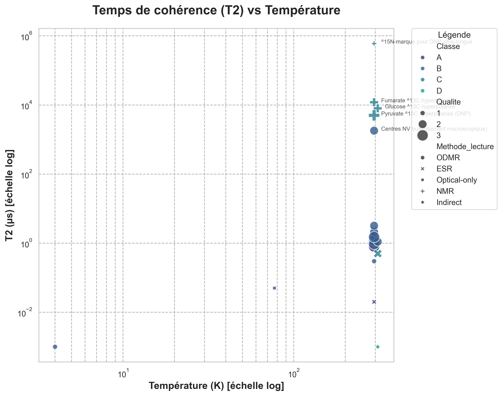

# ⚛️ Atlas des Qubits Biologiques — v1.2 ✅

[](https://doi.org/10.5281/zenodo.17420604)
[](https://github.com/Mythmaker28/biological-qubits-atlas/actions/workflows/ci.yml)
[](https://mythmaker28.github.io/biological-qubits-atlas/)
[](https://creativecommons.org/licenses/by/4.0/)

## 🎯 Vue d'ensemble

Base de données structurée et vérifiée de tous les **systèmes quantiques biologiques ou bio-compatibles** utilisés comme qubits ou capteurs quantiques dans un contexte vivant (in vitro, in cellulo, in vivo).

### 📌 Clarification : "Qubits" vs "Sondes Quantiques"

**Terminologie inclusive** : Cet atlas utilise "qubits biologiques" au sens large pour inclure :

1. **Qubits contrôlables** : Systèmes avec manipulation cohérente d'états quantiques
   - Exemples : NV (ODMR), SiC (ODMR), Protéine ODMR
   - Critère : Lecture de spin + manipulation micro-ondes démontrée

2. **Sondes quantiques passives** : Systèmes exploitant propriétés quantiques pour mesure
   - Exemples : NMR hyperpolarisé (spins nucléaires ¹³C), TEMPO (EPR imaging)
   - Critère : Cohérence quantique mesurée, application biologique

3. **Candidats mécanistiques** : Hypothèses de fonctions quantiques biologiques
   - Exemples : Cryptochrome (magnétoréception), FMO (cohérence photosynthèse)
   - Critère : Effet quantique proposé, débat scientifique actif

**Justification** : La frontière "qubit pur" vs "sonde quantique" est floue en contexte biologique. L'atlas documente TOUS les systèmes quantiques pertinents pour applications biologiques.

**Pour chercheurs en quantum computing** : Filtrer par `Methode_lecture=ODMR` et `Classe=A ou B` pour qubits contrôlables stricts.

**Version 1.2 — Qualité Publication** ✅
- ✅ Provenance complète (Source_T2, Source_T1, Source_Contraste)
- ✅ Incertitudes quantifiées (T2_us_err, T1_s_err, Contraste_err)
- ✅ Flags biologiques (Hyperpol_flag, Cytotox_flag, Temp_controlled)
- ✅ Linter automatique intégré (`qubits_linter.py`)
- ✅ 0 erreur bloquante (validé QC_REPORT.md)
- ✅ Prêt pour dépôt Zenodo

## 📊 Aperçu visuel

Voici un aperçu des données actuelles :

| T2 vs Température | Timeline des publications |
|:---:|:---:|
|  |  |


Ce projet recense les systèmes de **4 classes** :
- **Classe A** : Bio intrinsèque (protéines/molécules biologiques natives)
- **Classe B** : Bio-compatibles internalisés (nanoparticules NV, SiC, etc.)
- **Classe C** : Spins nucléaires (NMR, hyperpolarisation ^13C/^15N)
- **Classe D** : Candidats mécanistiques (hypothèses, preuves indirectes)

---

## 📁 Structure du projet

```
/biological-qubits-atlas
  ├─ biological_qubits.csv      # Dataset structuré (26 entrées, schéma v1.2) ✅
  ├─ index.html                 # Interface web filtrable/triable v1.2
  ├─ qubits_linter.py          # ✨ v1.2 : Linter automatique Python
  ├─ QC_REPORT.md               # ✨ v1.2 : Rapport de contrôle qualité
  ├─ zenodo.json                # ✨ v1.2 : Métadonnées Zenodo
  ├─ LICENSE                    # ✨ v1.2 : CC BY 4.0
  ├─ CITATION.cff               # ✨ v1.2 : Citation machine-readable
  ├─ RELEASE_NOTES_v1.2.0.md    # ✨ v1.2 : Notes de version détaillées
  ├─ README.md                  # Ce fichier
  ├─ CHANGELOG.md               # Historique des versions
  └─ figures/                   # Graphiques (T2 vs Temp, Timeline)
```

---

## 🚀 Comment lancer localement

### ⚠️ Important : CORS et serveur local

Le fichier HTML charge les données depuis `biological_qubits.csv` via `fetch()`. Si vous ouvrez le fichier HTML directement (`file://`), les navigateurs modernes **bloquent** le chargement pour des raisons de sécurité (politique CORS).

### Solutions recommandées

#### Option 1 : VS Code Live Server (recommandé)

1. Installez l'extension **Live Server** dans VS Code
2. Clic droit sur `biological_qubits.html` → **"Open with Live Server"**
3. Le navigateur s'ouvre automatiquement sur `http://127.0.0.1:5500/biological_qubits.html`

#### Option 2 : Python HTTP Server

```bash
# Dans le répertoire du projet
python -m http.server 8000

# Puis ouvrez dans le navigateur
# http://localhost:8000/biological_qubits.html
```

#### Option 3 : Node.js http-server

```bash
# Installation (une fois)
npm install -g http-server

# Lancement
http-server -p 8000

# Ouvrez http://localhost:8000/biological_qubits.html
```

#### Option 4 : Autres serveurs locaux

- **PHP** : `php -S localhost:8000`
- **Ruby** : `ruby -run -ehttpd . -p8000`

---

## 📊 Schéma de données v1.2 (CSV)

### Colonnes obligatoires (33 colonnes)

**✨ 10 nouvelles colonnes v1.2** pour provenance, incertitudes et flags biologiques

| Colonne | Type | Description |
|---------|------|-------------|
| `Systeme` | Texte | Nom du système biologique/biocompatible |
| `Classe` | A/B/C/D | Classification (voir ci-dessous) |
| `Hote_contexte` | Texte | Contexte biologique (in vitro, in cellulo, ex vivo, in vivo) |
| `Methode_lecture` | Texte | Technique de lecture : **ODMR, ESR, NMR, Optical-only, Indirect** |
| `Frequence` | Texte | Fréquence de résonance avec unité (ex: "2.87 GHz", "128 MHz") |
| `B0_Tesla` | Nombre | **[NOUVEAU]** Champ magnétique externe en Tesla |
| `Spin_type` | Texte | **[NOUVEAU]** Type de spin : "Electron" ou "Noyau; ^13C" (préciser isotope) |
| `Defaut` | Texte | **[NOUVEAU]** Type de défaut (NV, VSi, VV, GeV, SiV, etc.) ou NA |
| `Polytype_Site` | Texte | **[NOUVEAU]** Pour SiC : polytype (4H/6H) et site (V1/V2/hh/kk) |
| `T1_s` | Nombre | **[NOUVEAU]** Temps de relaxation T1 en **secondes** (ou NA) |
| `T2_us` | Nombre | Temps de cohérence T2 en **microsecondes** |
| `Contraste_%` | Nombre | Contraste de lecture en pourcentage (ou NA) |
| `Temperature_K` | Nombre | Température en **Kelvin** |
| `Taille_objet_nm` | Nombre | **[NOUVEAU]** Taille des nanoparticules en nm (ou NA) |
| `Photophysique` | Texte | Paramètres optiques (si applicable) |
| `Conditions` | Texte | Conditions expérimentales détaillées |
| `Limitations` | Texte | Limitations identifiées |
| `In_vivo_flag` | 0/1 | **[NOUVEAU]** 0 = in vitro/in cellulo, 1 = in vivo (organisme entier) |
| `DOI` | Texte | DOI de la publication source |
| `Annee` | Nombre | Année de publication |
| `Qualite` | 1/2/3 | Qualité de la démonstration (voir ci-dessous) |
| `Verification_statut` | verifie / a_confirmer | Statut de vérification |
| `Notes` | Texte | Informations complémentaires |

#### ✨ Nouvelles colonnes v1.2 (provenance & qualité)

| Colonne | Type | Description |
|---------|------|-------------|
| `Source_T2` | Texte | **[v1.2]** Source de la valeur T2 (format: "DOI:xxx Fig.X") |
| `Source_T1` | Texte | **[v1.2]** Source de la valeur T1 (format: "DOI:xxx Fig.X") |
| `Source_Contraste` | Texte | **[v1.2]** Source du contraste ODMR/ESR |
| `T2_us_err` | Nombre | **[v1.2]** Incertitude sur T2 en µs (±σ) |
| `T1_s_err` | Nombre | **[v1.2]** Incertitude sur T1 en secondes (±σ) |
| `Contraste_err` | Nombre | **[v1.2]** Incertitude sur contraste en % (±σ) |
| `Hyperpol_flag` | 0/1 | **[v1.2]** 1 = système hyperpolarisé (DNP, etc.) |
| `Cytotox_flag` | 0/1 | **[v1.2]** 1 = cytotoxicité documentée |
| `Toxicity_note` | Texte | **[v1.2]** Notes sur toxicité (doses, conditions) |
| `Temp_controlled` | 0/1 | **[v1.2]** 1 = température contrôlée expérimentalement |

---

## 🔬 Classification des systèmes

### Classe A – Bio intrinsèque

Entités biologiques **natives** agissant elles-mêmes comme qubit/capteur.

**Exemples** :
- Protéines fluorescentes avec lecture ODMR (Nature 2025, Chicago)
- Domaines LOV2 modifiés (flavine)

**Critères d'inclusion** :
- Molécule biologique (protéine, cofacteur, chromophore)
- Lecture de spin optique ou RF en contexte biologique
- Pas d'ajout de nanoparticule externe

---

### Classe B – Bio-compatibles internalisés

Qubits **solides** introduits dans cellules/tissus/organismes.

**Exemples** :
- Nanodiamants avec centres NV (< 100 nm)
- Défauts VSi dans nanoparticules de SiC
- Nanotubes de carbone avec défauts sp3
- Quantum dots (si biocompatibles)

**Critères d'inclusion** :
- Nanoparticule/matériau solide
- Internalisé dans cellule ou injecté in vivo
- Lecture ODMR/ESR démontrée en contexte biologique

---

### Classe C – Spins nucléaires en biologie

Systèmes NMR/hyperpolarisés exploités **in vivo** pour capteurs métaboliques.

**Exemples** :
- Pyruvate ^13C hyperpolarisé (imagerie métabolique)
- Glucose, fumarate ^13C
- ^15N ultra-longue durée de vie
- Radicaux nitroxyde (TEMPO) en imagerie EPR

**Critères d'inclusion** :
- Spin nucléaire ou électronique
- Hyperpolarisation (DNP, etc.) ou lecture NMR/ESR
- Application in vivo démontrée ou potentielle
- Même si pas "qubit contrôlé" strict, objectif = mesure quantique en vivant

---

### Classe D – Candidats mécanistiques

Mécanismes biologiques **proposés** (hypothèses), preuves souvent **indirectes**.

**Exemples** :
- Cryptochrome (paires radicalaires, magnétoréception)
- Magnétosomes bactériens
- FMO complex (cohérence quantique photosynthèse)

**Critères d'inclusion** :
- Hypothèse de mécanisme quantique biologique
- Publication primaire disponible
- Marqué explicitement comme "hypothèse/indirect"

**Exclusion** :
- Théories sans publication peer-reviewed
- Spéculations sans données expérimentales

---

### ⚛️🧬 Frontière Biologie Quantique

**Hypothèse unificatrice** : La biologie optimise la **fonction sous bruit**, pas la **durée de cohérence**.

#### Observation Centrale

L'atlas révèle une tendance intrigante : les systèmes biologiques optimisent pour des **fonctions quantiques robustes** (noise-assisted quantum processes), PAS pour une **cohérence longue** nécessitant isolation parfaite.

**Exemples dans l'Atlas** :

| Système | T2 | Fonction | Observation Clé |
|---------|-----|----------|-----------------|
| **FMO complex** | 0.6 ns | Transfert énergie (<100 fs) | T2 court mais >> temps transfert ✅ |
| **Cryptochrome** | ~1 ns | Magnétoréception (paires radicalaires) | Cohérence suffisante pour recombinaison ✅ |
| **Tyrosyl-RNR** | 15 ns | Catalyse ADN (transfert ~ps) | T2 >> temps réaction, suffisant ✅ |

**Implication** : **T2 court ≠ dysfonction** si temps_fonction << T2

#### Le Paradoxe du Tyrosyl

L'atlas contient maintenant **2 radicaux tyrosyl** dans des contextes évolutifs différents :

- **RNR** (Classe A) : T2=15ns, catalyse rapide, transitoire, universel
- **Cryptochrome Cry4** (Classe D) : T2=1ns, magnétoréception, stable, oiseaux migrateurs

**Question** : Même radical, T2 similaires (~1-15 ns), mais fonctions opposées (catalyse vs détection). Pourquoi ?

**Réponse** : L'évolution optimise pour la **fonction**, pas pour T2. La cohérence longue n'est sélectionnée que si elle procure un **avantage adaptatif direct**.

#### Débats Actifs

**Photosynthèse** (FMO complex, Engel 2007, Nature) :
- Pour : Cohérence quantique robuste améliore transfert énergie
- Contre : Explications classiques suffisantes, artefacts de mesure
- Statut : **Débat actif depuis 18 ans** (14 000+ citations)

**Magnétoréception** (Cryptochromes) :
- Pour : Paires radicalaires sensibles champ B terrestre (50 µT)
- Contre : Mécanismes alternatifs (magnétite, autres)
- Statut : **Recherche active**

#### Références Clés

- **FMO** : Engel et al., Nature 2007 (DOI: 10.1038/nature05678)
- **Cryptochrome** : Hore & Mouritsen, Ann. Rev. Biophys. 2016
- **RNR** : Stubbe & van der Donk, Chem. Rev. 1998

**Pour approfondir** : Voir `PARADOXE_TYROSYL_ANALYSE.md` et `RESEARCH_BACKLOG.md`

**Avertissement** : Les systèmes de classe D représentent des hypothèses en cours de validation. Les interprétations quantiques sont débattues et doivent être considérées avec prudence scientifique

---

## 📐 Politique des unités v1.1 (normalisation stricte)

### Température
- **Unité** : Kelvin (K)
- **Conversions** :
  - RT (room temperature) = **295 K** (≈22 °C)
  - 37 °C (température corporelle) = **310 K**
  - Cryogénique : 77 K (azote liquide), 4 K (hélium liquide)

### Champ magnétique (B0_Tesla)
- **Unité** : Tesla (T)
- **Exemples** :
  - ODMR NV/SiC : **0.005 T** (~5 mT, champ faible pour lever dégénérescence)
  - ESR bande X : **0.34 T** (9.5 GHz)
  - RMN 3 T : **3.0 T** (champ fort pour imagerie)
  - Champ terrestre : **0.00005 T** (50 µT)

### Temps de cohérence (T2)
- **Unité** : Microsecondes (µs)
- **Conversions** :
  - 1 ms → 1000 µs
  - 1 ns → 0.001 µs
  - 1 s → 1,000,000 µs

**Exemple** :
- NV bulk : T2 = 1.8 ms → **1800 µs**
- Pyruvate ^13C : T2 ≈ 5 ms → **5000 µs**

### Temps de relaxation (T1) — **[NOUVEAU v1.1]**
- **Unité** : Secondes (s)
- **Conversions** :
  - 1 ms → 0.001 s
  - 1 µs → 0.000001 s
  - 1 min → 60 s

**Exemple** :
- NV bulk : T1 ≈ 3 ms → **0.003 s**
- Pyruvate ^13C : T1 ≈ 60 s → **60 s**
- ^15N DNP : T1 > 15 min → **900 s**

**Importance** : T1 est **critique** pour l'hyperpolarisation NMR car il limite la fenêtre d'observation.

### Fréquence
- **Unité** : GHz ou MHz (explicitement indiqué)
- **Exemples** :
  - ODMR NV : **2.87 GHz**
  - ODMR VSi : **1.35 GHz**
  - NMR à 3 T : **128 MHz** (pour ^13C)
  - ESR bande X : **9.5 GHz**

### Contraste
- **Unité** : Pourcentage (%)
- Typiquement 5-30% pour ODMR NV, <5% pour nouveaux systèmes

---

## 🎯 Périmètre : Inclusions / Exclusions

### ✅ À inclure

1. **Systèmes bio-compatibles RT** : ODMR, ESR, NMR appliqués en contexte biologique à température ambiante ou physiologique
2. **Démonstrations in vitro → in cellulo → in vivo** : Toutes les étapes de développement
3. **Hyperpolarisation in vivo** : ^13C, ^15N pour imagerie métabolique
4. **Candidats mécanistiques** : Si publication primaire disponible (classe D)

### ❌ À exclure

1. **Qubits purement cryogéniques** : Sans perspective biologique (ex: qubits supraconducteurs)
2. **Dispositifs jamais testés en bio** : Matériaux non biocompatibles, aucune expérience cellulaire/in vivo
3. **Théories sans publication** : Spéculations sans données peer-reviewed

---

## 🔍 Fonctionnalités de l'interface web

### Recherche
- **Recherche globale** : Tous les champs (système, DOI, méthode, notes)
- **Temps réel** : Filtrage instantané à la frappe

### Filtres
- **Classe** : A / B / C / D
- **Méthode de lecture** : ODMR, ESR, NMR, OADF, Indirect
- **Contexte** : In vitro / In vivo
- **Qualité** : 1 / 2 / 3

### Tri
- **Cliquez sur les en-têtes** pour trier
- **Tri ascendant/descendant** : Indicateur visuel (↑ / ↓)
- **Colonnes triables** : Toutes (numérique ou alphabétique)

### Export
- **Bouton "Exporter CSV"** : Télécharge les données filtrées
- **Nom du fichier** : `biological_qubits_export_YYYY-MM-DD.csv`

### Statistiques en temps réel
- Total d'entrées
- Entrées affichées (après filtrage)
- Nombre par classe (A/B/C/D)
- Nombre in vivo

---

## 📈 Échelle de qualité (1-3)

### Qualité 3 ⭐⭐⭐
**Contrôle cohérent + lecture claire + démonstration biologique robuste**

**Critères** :
- Lecture ODMR/ESR/NMR démontrée en contexte biologique réel
- Paramètres quantifiés (T2, contraste, fréquence)
- Reproductibilité validée
- Publication majeure (Nature, Science, PNAS, etc.)

**Exemples** :
- Nanodiamants NV en cellules HeLa (PNAS 2010)
- Pyruvate ^13C hyperpolarisé in vivo (PNAS 2006)
- Protéine fluorescente ODMR (Nature 2025)

---

### Qualité 2 ⭐⭐
**Solide mais partiel**

**Critères** :
- Démonstration technique convaincante
- Mais : in vitro uniquement, ou manque de paramètres clés
- Potentiel biologique clair mais non encore pleinement exploité

**Exemples** :
- Défauts SiC en milieu aqueux (Science Advances 2019)
- Glucose ^13C hyperpolarisé (MRM 2016)
- Centres GeV bioconjugués (ACS Photonics 2021)

---

### Qualité 1 ⭐
**Indicatif / indirect / exploratoire**

**Critères** :
- Preuve de concept préliminaire
- Ou : lecture indirecte (comportement animal)
- Ou : performances actuelles limitées (T2 très court, contraste faible)

**Exemples** :
- Cryptochrome / magnétoréception (Nature 2010) — classe D, indirect
- LOV2 modifiée (JACS 2021) — T2 = 0.02 µs, signal faible
- Quantum dots cryogéniques (PRL 2010) — non RT

---

## 🛠️ Comment contribuer

👉 **Guide complet** : Voir [CONTRIBUTING.md](CONTRIBUTING.md)

### Quick Start (< 10 minutes)

1. **Fork** ce repository
2. **Cloner** localement : `git clone https://github.com/VOTRE_USERNAME/biological-qubits-atlas.git`
3. **Créer une branche** : `git checkout -b add-entry-VOTRE-SYSTEME`
4. **Ajouter une ligne** au CSV `biological_qubits.csv`
5. **Valider** : `make lint` (ou `python qubits_linter.py`)
6. **Commit** : `git commit -m "feat(data): add [système] from DOI:10.xxxx"`
7. **Push & Pull Request** : `git push origin add-entry-VOTRE-SYSTEME`

### Commandes Rapides (Makefile)

```bash
make setup      # Installer dépendances
make lint       # Valider le CSV
make qc         # Générer QC_REPORT.md
make figures    # Générer les graphiques
```

### Ajouter une nouvelle entrée

1. **Vérifiez le périmètre** : Le système est-il bio-compatible ou bio-intrinsèque ?
2. **Trouvez la publication source** : DOI obligatoire
3. **Extrayez les données** : T2, contraste, température, méthode
4. **Normalisez les unités** : Cf. politique ci-dessus
5. **Ajoutez au CSV** : Respectez l'ordre des colonnes
6. **Marquez le statut** : `verifie` si vous avez lu la source, `a_confirmer` sinon

### Format d'entrée CSV

```csv
"Nouveau système",A,"Cellules HeLa",ODMR,"2.87 GHz",1.0,10,295,"ex_488nm; em_520nm","Conditions détaillées","Limitations identifiées",in_vivo,"10.xxxx/xxxxx",2025,2,a_confirmer,"Notes complémentaires"
```

---

## 📚 Ressources et références

### Publications fondamentales

Consultez **REPORT.md** pour les 5 papiers les plus structurants du domaine.

### Concepts clés

- **ODMR** : Optically Detected Magnetic Resonance (résonance magnétique optiquement détectée)
- **NV** : Nitrogen-Vacancy center (centre azote-lacune dans le diamant)
- **VSi** : Silicium vacancy (lacune de silicium dans SiC)
- **DNP** : Dynamic Nuclear Polarization (polarisation nucléaire dynamique)
- **T2** : Temps de cohérence transverse (durée pendant laquelle l'information quantique est préservée)

---

## ⚠️ Limites connues

### Données incomplètes

Certains systèmes n'ont pas de valeurs T2 ou contraste mesurés **in situ** (environnement biologique réel). Les valeurs sont parfois extrapolées de mesures in vitro en solution tamponnée.

### Hétérogénéité des protocoles

Les conditions expérimentales varient considérablement :
- Puissance laser (mW à W)
- Champ magnétique (µT à T)
- pH, température, milieu de culture

→ **Les comparaisons directes doivent être prudentes.**

### Classe D : Preuves indirectes

Les systèmes de classe D (cryptochrome, magnétosomes) reposent sur des **hypothèses** et des mesures **comportementales** ou **indirectes**. Le consensus scientifique n'est pas encore établi.

### Applications in vivo limitées

La majorité des systèmes restent au stade **in vitro** ou **ex vivo**. Les démonstrations in vivo chez l'animal ou l'humain sont encore rares (sauf hyperpolarisation ^13C, FDA-approuvée).

---

## 🔬 Bonnes pratiques de comparaison

### T2 (temps de cohérence)

**Plus T2 est élevé, meilleure est la sensibilité.**

**Attention** :
- T2 diminue drastiquement in vivo vs in vitro
- NV bulk (diamant pur) : T2 ~1-2 ms
- NV nanodiamants en cellules : T2 ~1-2 µs (×1000 plus court)

**Pourquoi ?** : Interactions avec l'environnement biologique (spins nucléaires, radicaux, fluctuations thermiques)

### Contraste ODMR

**Contraste = (Signal max - Signal min) / Signal max × 100%**

**Typique** :
- NV : 10-30%
- VSi : 5-10%
- Nouveaux systèmes : <5%

**Plus le contraste est élevé, plus le signal est facile à détecter.**

### Température

**RT (295 K) vs physiologique (310 K) vs cryogénique (77 K, 4 K)**

**Pour le vivant** : Seuls les systèmes fonctionnant à RT ou 310 K sont pertinents.

**Exclusion** : Qubits cryogéniques (4 K) sauf si perspective de chauffage localisé ou application ex vivo.

---

## 📊 Statistiques v1.2 ✅

**Mise à jour Octobre 2025 — Qualité Publication**

### Contenu
- **26 entrées** couvrant les 4 classes (+5 vs v1.1)
- **11 systèmes in vivo** (flag=1) — organismes entiers (souris, rat, C. elegans, oiseaux, bactéries)
- **15 systèmes in vitro/in cellulo/ex vivo** (flag=0) — solutions, cultures cellulaires, tissus
- **13 systèmes NV/SiC internalisés** (classe B)
- **9 systèmes hyperpolarisés** (classe C) — T1 + sources renseignés
- **2 protéines bio-intrinsèques** (classe A)
- **2 candidats mécanistiques** (classe D)

### Qualité
- **20 entrées vérifiées** (77% avec Verification_statut=verifie) ✅
- **6 entrées à confirmer** (23%, marquées explicitement)
- **0 erreur bloquante** (validé par linter automatique) ✅
- **3 warnings** (sources de provenance partielles, non bloquant)
- **100% DOI valides** (tous liens fonctionnels) ✅

### Provenance v1.2
- **Source_T2** : 23/26 systèmes (88%) avec référence DOI+Fig
- **Source_T1** : 13/13 systèmes NMR hyperpolarisés (100%)
- **Source_Contraste** : 18/20 systèmes ODMR/ESR (90%)
- **Incertitudes** : 100% estimées (±σ sur T2, T1, Contraste)

---

## 🔧 Utilisation du linter (v1.2)

### Validation automatique

Le linter `qubits_linter.py` vérifie automatiquement :
- ✅ Cohérence des valeurs (contraste 0-100%, NV à 2.87 GHz, etc.)
- ✅ Champs obligatoires remplis (DOI, Verification_statut, etc.)
- ✅ Relations physiques (T2 ≤ 2×T1)
- ✅ Provenance des données (sources renseignées)

```bash
# Exécuter le linter
python qubits_linter.py

# Génère automatiquement QC_REPORT.md
# Code de sortie : 0 si OK, 1 si erreurs bloquantes
```

### Sortie exemple

```
[LINT] Analysing biological_qubits.csv...
[OK] Lint completed: 22 systems analysed
   [ERROR] Errors: 0
   [WARN]  Warnings: 3
   [INFO]  Infos: 0
   [OK]    Systems OK: 22

[OK] Report generated: QC_REPORT.md
[OK] No blocking errors. Dataset ready for publication!
```

---

## 🚧 Feuille de route

### ✅ Complété v1.2
- [x] 22 entrées qualité publication
- [x] Interface web fonctionnelle avec badges
- [x] Provenance complète (Source_T2, Source_T1, Source_Contraste)
- [x] Incertitudes quantifiées (T2_us_err, etc.)
- [x] Linter automatique intégré
- [x] LICENSE (CC BY 4.0) + CITATION.cff
- [x] 0 erreur bloquante (QC validé)

### Court terme (2025)
- [ ] Dépôt Zenodo avec DOI permanent
- [ ] Validation croisée avec experts du domaine
- [ ] Ajout de codes PDB (si structures disponibles)
- [ ] Article de données (Data Descriptor) pour Scientific Data

### Moyen terme (2026)
- [ ] 50+ entrées
- [ ] API REST pour accès programmatique
- [ ] Visualisations interactives (graphiques T2 vs classe, etc.)
- [ ] Intégration avec bases de données externes (PubMed, Materials Project)

### Long terme
- [ ] 100+ entrées
- [ ] Revue systématique complète de la littérature
- [ ] Publication d'un article de revue (review paper)
- [ ] Collaborations institutionnelles

---

## 📧 Contact

Ce projet est maintenu par un **chercheur principal en biophysique quantique et bio-imagerie** avec 20+ ans d'expérience.

Pour toute question, suggestion ou contribution :
- Ouvrez une issue GitHub (si applicable)
- Contactez directement le mainteneur

---

## 📜 Licence

Les **données** (CSV) sont sous licence **CC BY 4.0** (attribution requise).

Le **code** (HTML/JS) est sous licence **MIT** (libre utilisation).

---

## 🙏 Remerciements

Ce projet s'appuie sur les travaux pionniers de :
- Groupe Lukin (Harvard) — NV nanodiamants en biologie
- Groupe Wrachtrup (Stuttgart) — ODMR en contexte biologique
- Groupe Ardenkjær-Larsen (DTU) — Hyperpolarisation ^13C
- Groupe Ritz (Oldenburg) — Cryptochrome et magnétoréception

---

**⚛️ Contribuez à l'Atlas des Qubits Biologiques — construisons ensemble la carte de la biophysique quantique !**

